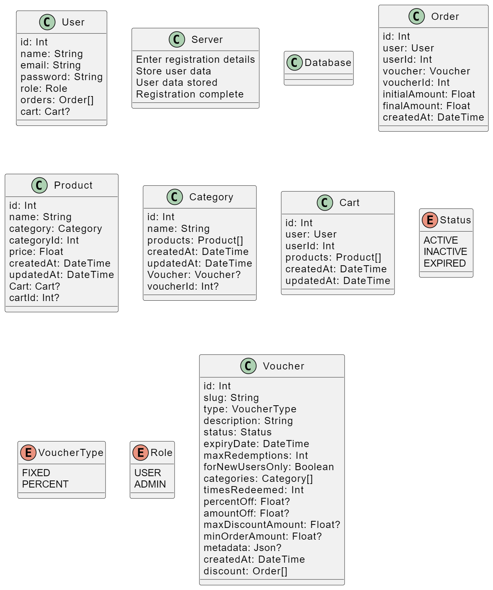
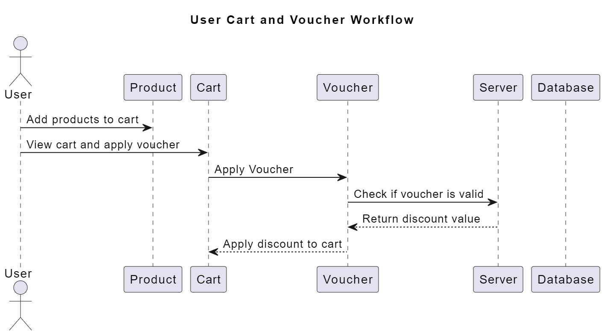

# Voucher Service Backend System

This project is a voucher service backend system built using Node.js, Express.js, and PostgreSQL database. It provides functionality to generate, manage, and redeem vouchers.

## Table of Contents

- [Installation](#installation)
- [Usage](#usage)
- [Database Model](#database-model)
- [API Diagram](#api-diagram)

## Installation

1. Clone the repository:

```
git clone https://github.com/ikaushiksharma/voucher-system.git
```

2. Navigate to the project directory:

```
cd voucher-system
```

3. Setup ENVs:

```
cp .env.example .env
```

## Usage

1. Start the PostgreSQL database and Server using Docker Compose:

```
docker-compose up -d
```

2. Push DB Schema to PostgreSQL:

```
docker exec -it voucher-system-app-1 npx prisma db push
```

The server will be running at `http://localhost:3000`.

## Class Diagram



## WorkFlow Diagram


